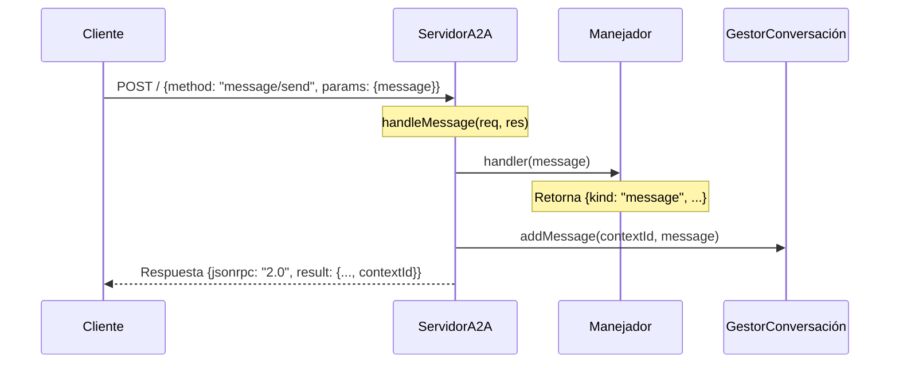
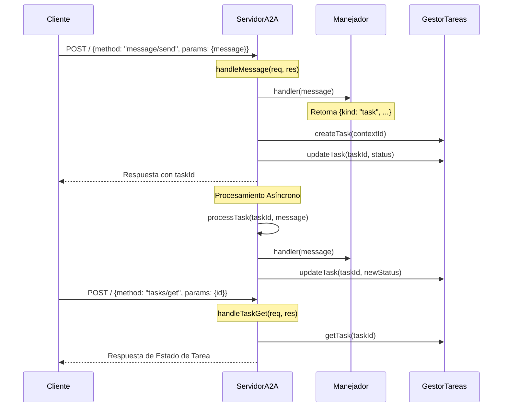

# Documentación de Flujos del Servidor A2A

Este documento explica los dos flujos principales en el Servidor A2A: Respuesta Inmediata (kind: "message") y Respuesta Basada en Tareas (kind: "task").

## Flujo de Respuesta Inmediata (kind: "message")



### Pasos del Flujo:

1. **Solicitud Inicial**

   - Endpoint: POST /
   - Función: `handleMessage(req: Request, res: Response)`
   - Parámetros:
     ```typescript
     {
       method: "message/send",
       params: { message: {...} }
     }
     ```

2. **Procesamiento del Manejador**

   - Función: `handler(message)`
   - Retorna respuesta inmediata con:
     ```typescript
     {
       kind: "message",
       // Datos adicionales de respuesta
     }
     ```

3. **Gestión de Conversación**

   - Función: `conversationManager.addMessage(contextId, message)`
   - Almacena el mensaje en el historial de conversación

4. **Respuesta**
   - Retorna respuesta inmediata al cliente con:
     ```typescript
     {
       jsonrpc: "2.0",
       id: requestId,
       result: {
         ...response,
         contextId
       }
     }
     ```

## Flujo de Respuesta Basada en Tareas (kind: "task")



### Pasos del Flujo:

1. **Solicitud Inicial**

   - Igual que el flujo de mensajes
   - Función: `handleMessage(req: Request, res: Response)`

2. **Respuesta Inicial del Manejador**

   - Función: `handler(message)`
   - Retorna respuesta de tarea:
     ```typescript
     {
       kind: "task",
       id: taskId,
       contextId: string,
       status: {
         state: "working" | "completed" | "error",
         progress: { percentage: number, message: string }
       }
     }
     ```

3. **Creación de Tarea**

   - Función: `taskManager.createTask(contextId)`
   - Función: `taskManager.updateTask(taskId, { state, progress, result })`

4. **Respuesta Inicial**

   - Retorna información de la tarea al cliente:
     ```typescript
     {
       jsonrpc: "2.0",
       id: requestId,
       result: taskResponse
     }
     ```

5. **Procesamiento Asíncrono**

   - Función: `processTask(taskId: string, message: any)`
   - Continúa el procesamiento en segundo plano
   - Actualiza el estado de la tarea mediante `taskManager.updateTask()`

6. **Verificación de Estado de Tarea**

   - Endpoint: POST / (method: "tasks/get")
   - Función: `handleTaskGet(req: Request, res: Response)`
   - Parámetros:
     ```typescript
     {
       method: "tasks/get",
       params: { id: taskId }
     }
     ```

7. **Respuesta de Estado de Tarea**
   - Retorna el estado actual de la tarea:
     ```typescript
     {
       jsonrpc: "2.0",
       id: requestId,
       result: {
         id: taskId,
         contextId: string,
         status: {
           state: string,
           timestamp: string,
           progress: { percentage: number, message: string }
         },
         kind: "task",
         artifacts?: any
       }
     }
     ```

## Operaciones Adicionales

### Cancelación de Tarea

- Endpoint: POST / (method: "tasks/cancel")
- Función: `handleTaskCancel(req: Request, res: Response)`
- Actualiza el estado de la tarea a "error" con mensaje de cancelación
